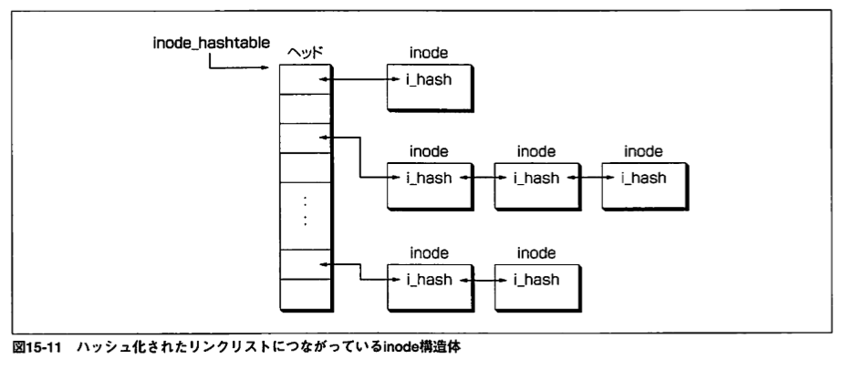
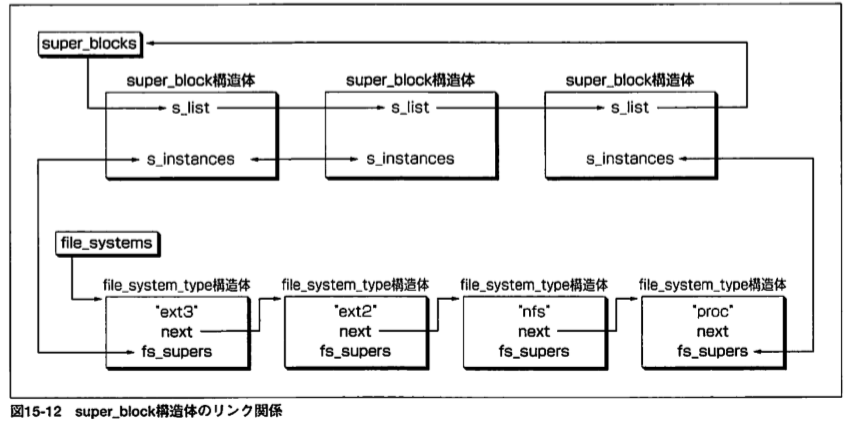
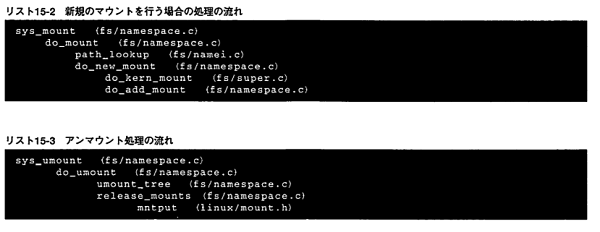

# 15章5～10
## 前回の復習+
* inodeはindex_nodeの略であり、1つのファイルやディレクトリに対して一意に対応する管理情報が保存されているデータ構造。
* dentryはファイルの使用が終了しても再び使用されることに備えて直ぐには解放しない。ページの回収処理の際に解放される。
* super_block構造体：ファイルシステム共有の管理情報を扱う。
* vfsmount構造体：マウントされたファイルシステムの位置関係の管理。

## 15.5 inode構造体の管理構造
 inode構造体もハッシュ化リンクとつながっており、inodeのヘッドはsuper_block構造体のアドレスとiノード番号から計算される。   
  
 また、inode構造体はi_listメンバーを用いて状態を表すリストにつながる。  
 
   
inode構造体はdentry構造体と相互にポイントしているため、dentry構造体が解放された後に解放される。そのため、inode構造体のハッシュ化リストはdentry構造体の登場以降、使う機会が減少した。  

`$df -i` で現在のinode領域の使用状況を確認できる。各項目の意味は以下の通り  
* Inodes： デバイスで作成できるinodeの限界値
* IUsed ： 現在の使用量
* IFree ： 残り
* IUse  ： 使用率
  
また `$ls -i` によってinode番号を見ることができる。

## 15.6 super_block構造体の管理構造
super_blocksをヘッドとしてファイルシステムの種別が同じfile_system_type構造体のリンクとつながっている。  
リンクリストはまとめて書き込むためにキャッシュしているデータをディスクに書き込むsync処理などの全ファイルシステムを検索する際に使用される。  
  
### file_system_type
この構造体は各ファイルシステム種別ごとに存在する。  
リンクリストはマウント処理時に同じファイルシステムがマウントされていないか確認する際に使用される。  

  
## 15.7 名前空間の構成
Linuxの名前空間はファイルシステムによってあるパーティションとあるディレクトリを関連づける操作(マウント)をすることによって構成されている。  

### vfsmount構造体
マウント関係の保持のための管理構造。名前空間上のでのファイルシステムの根幹。もちろんハッシュリストにつながっている。  
mnt_sbが実体のファイルシステムであるsuper_block構造体へ一方的にポイントしている。  
同じファイルシステムに複数ディレクトリがマウントしている際にvfsmount構造体はマウントごとに存在するが、super_block構造体は1つに限る。  
マウント関係を表すmnt_mountsをvfsmount構造体につなげることで親子関係をつくることができる。  
ハッシュのヘッダは親vfsmount構造体のアドレスとdentry構造体のアドレスから計算される。この構造体の検索処理を用いてパス名のルックアップ処理ができる。逆に、dentry構造体はマウントの有無は記憶していてもマウントしているvfsmount構造体を記憶していないため、vsfmount構造体を用いる必要がある。ヘッダ数は1ページ分確保される。  
  
### namespace構造体
vfsmount構造体はnamespace構造体の一部として存在している。  
プロセスは１つのネームスペース上で動作しており、その領域はtask_struct構造体の中に記述されている。通常、initプロセスで生成されるnamespace構造体を使用し、fork時にも受け継がれるため、別の構造体を使用するにはプロセス生成時にCLONE_NEWSフラグを指定しなければならない。この時、namespaceとvfsmountの構造を維持したまま複製する。マウントの状態は他のネームスペースに属するプロセスからは見えないようになっている。

### fs_struct構造体
task_struct構造体のメンバーのfsメンバーがポイントしている構造体。カレントディレクトリやルートディレクトリ情報を保持する。そのため、dentry構造体とvfsmount構造体の情報を保持する。  
fork時には複製される。CLONE＿FSフラグによって共有させることもできる。このフラグはスレッドの実装に使用される。

## 15.8 ファイルオペレーション・15章まとめ
VFS層の役割はファイルシステムへ処理を振ることであるとも言える。その処理方法はファイルシステムが各自inode構造体に関数を設定しており、VFS層には複雑な操作を必要とせずに、関数の呼び出しをすることで処理をすることができるような構造になっている。また、ファイルシステムの判別はオペレーションの有無によって行うこともある。  

## 15.9 名前空間の実装
### パス名ルックアップ処理の実装
パス名ルックアップ処理をする流れは以下のとおりである。
1. nameidata関数を設定
2. link_path_walk関数の呼び出し
ルックアップ処理をしている本体はlink_path_walk関数でありnameidata構造体はlink_path_walk関数の呼び出し元とのインターフェースであり、作業領域である。  
#### nameidata構造体
1. dentry、mnt
起点となるディレクトリを設定し、関数を呼び出す。通常、システムコールから呼び出された場合カレントディレクトリまたはルートディレクトリのdentry、vfsmount構造体が設定されるが、処理の途中ではルックアップ中のディレクトリのものを設定し、関数から復帰するときには目的のファイルのものを設定する。  
返される構造体は参照カウントをインクリメントされており、デクリメントするタイミングは処理によって変わる。また、デクリメントする際にはpath_releath関数が使用される。  
  
2. flags
ルックアップ処理にはバリエーションがあり、flagによって指定する。主なものには以下のものがある。  
* LOOKUP_PARENT
パスの最後のコンポーネントではなく、１つ上の構造体を取得するときのフラグ。
* LOOKUP_FOLLOW
パス名の最後のコンポーネントがシンボリックリンクである時にそれを展開しルックアップすることを指定するフラグ。通常指定する。指定しない場合としてはシンボリックファイルのオーナーを変えたい場合などがある。なお、パスの中間のファイルは必ず展開される。  
  
3. last、last_type
関数終了時にパスの最後のコンポーネントを設定して返るメンバー。LOOKUP_PARENTが指定されたときに意味を持つ。last_typeメンバーには補足情報が入り、エラーチェックなどに使用される。  
  
4. depth、save_names
save_nameメンバーはパス名の中のシンボリックリンクを記憶する、シンボリックリンクの作業領域である。入れ子の深さの制限値は５。  
処理にはこの構造体だけでなくtask_struct構造体内に含まれるパス名ルックアップ中のシンボリックリンクの総数を保持する制限値が40のtotal_link_count、深さの情報を保持するlink_countメンバーとともに使用される。  
  
#### link_path_walk関数
処理の延長で再帰的に呼び出されることがある。  

### マウント、アンマウントの実装
#### マウント処理 
do_mount関数によってマウントポイントのルックアップ処理を行ったあと、マウントのオプションによって呼び出す関数が変わる。新規である場合はdo_new_mount、リマウントである場合はdo_remountである。  
1. do_kern_mount関数
新規のvfsmount構造体を獲得し、初期化した後、スーパーブロックの獲得を行う。この際、スーパーブロックはファイルシステムタイプの対応するfile_system_type構造体のget_sbオペレーションによって実行される。fs_superリンクを辿り、既にスーパーブロックが見つかった場合s_activeをインクリメントする。見つからなかった場合、実際のスーパーブロックを読み出しsuper_block、dentry構造体を獲得、設定などが行われる。  
この関数によって作られたvfsmount構造体はわずかなメンバーのみで完全ではない。  
  
2. do_add_mount関数
vfsmount構造体をnamespace構造体のツリーのなかに組み入れ、ハッシュリストにつなげる。  
この関数によってvfsmount構造体のメンバーがすべて設定される。  
  
   
  
#### アンマウント処理
1. do_umount関数
アンマウントが可能かどうかvfsmount構造体の参照カウントによって判断する。  
※アンマウント処理のためにルックアップしているので、「参照カウント＝２」である。  
  
2. umount_tree関数
vfsmount構造体のリンク関係をすべて外し解放する。  
この作業が終わるまでvfsmoujnt_lockによって保護し、参照されることを防ぐ。  
  
* スーパーブロックの解放
release_mount関数内のmntput関数の延長で行う。別のvfsmount構造体によって使用されている場合、s_activeメンバーをデクリメントのみ行い、使用されなくなった時に解放される。この時、実行されるのはfile_system_type構造体のkill_sbオペレーションであり、ファイルシステムによって決められた解放処理が実行される。  
実行される主な処理は
    - dentry構造体の解放  
    - dirtyなinodeの書き出し  
    - inodeの解放  
    - super_blockの書き戻し 

などが行われる。  
これらの処理が行われる際に起きた以上はアンマウントシステムコールの復帰値には反映されず、スーパーブロック内に情報が書き込まれる。書き込めない場合もある。  
  
また、アンマウント処理の際、vfsmount構造体での処理が主であり、これはLinuxにおいてマウント処理が名前空間上の操作であることを示している。  

## 参考
* [Linuxのファイルシステムについて](https://qiita.com/kamihork/items/fbcd116a631324aae05d)
* Linuxカーネル解読室2.6 15章
