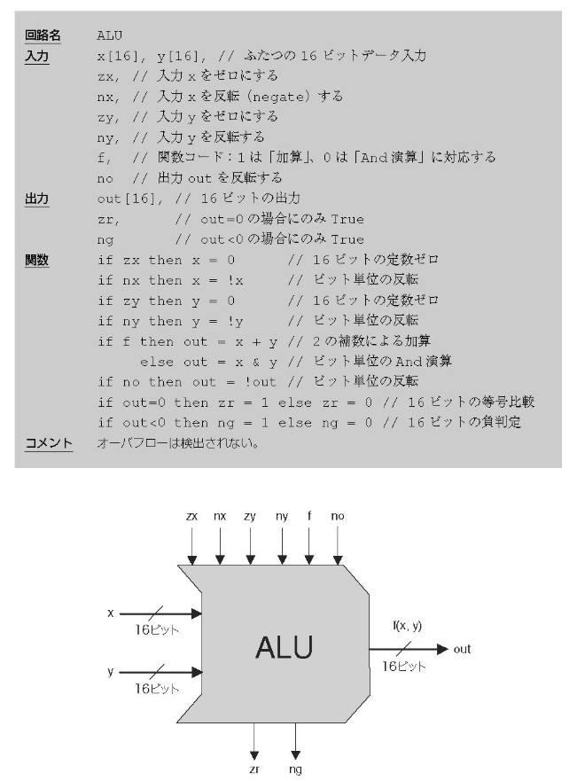

# ALU実装と乗算と除算と
## 前回の補足
### inc回路
各桁、値が変わるのは自分より下のbitがすべて1である時。  
    ――→ANDとXORでつなげばいいじゃん！  
  
  
### dec回路
incと逆に考える。  

## ALU
ALU：Arithmetic Logic Unit(算術論理演算器)  

## シフト
### 論理シフト
シフトすることで空く桁に必ず0を入れる。nビット左シフトは2^n倍、右シフトは2^(-n)倍を意味する。  
  
### 算術シフト
右シフト時に先頭(符号bit)をシフトすることで空く桁に入れる。負の数に対応できる。 
  

### 

## 乗算
### 符号なし乗算器
筆算と同じようにする。  
  
  
[HDL実装例](https://github.com/NeM-T/hdl_practice/blob/master/multiplier/multiplier2.sv)  
  
これは簡単な実装例であり、もっと最適化されたものはある。  
[これ](http://kivantium.hateblo.jp/entry/2016/12/08/000000)とか。  
  
### 符号付き乗算器

## 除算

## （ALUを拡張）
