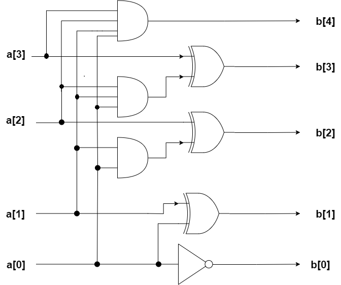
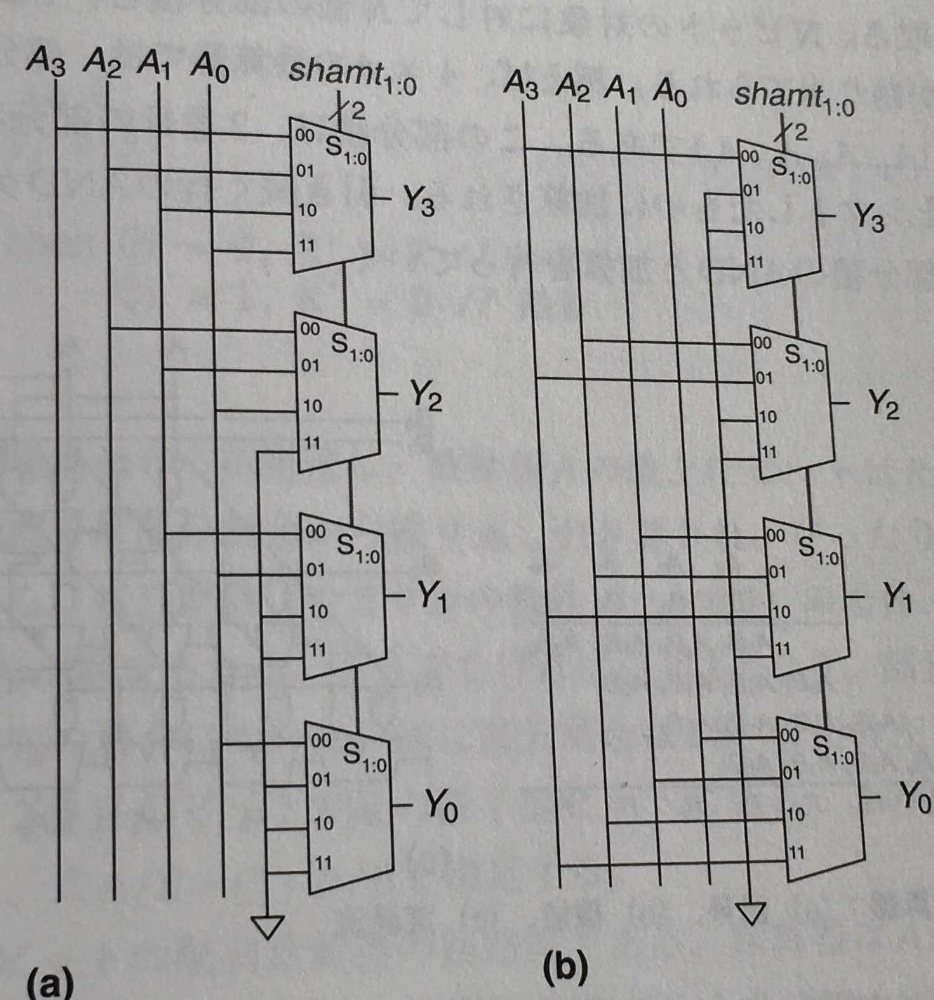
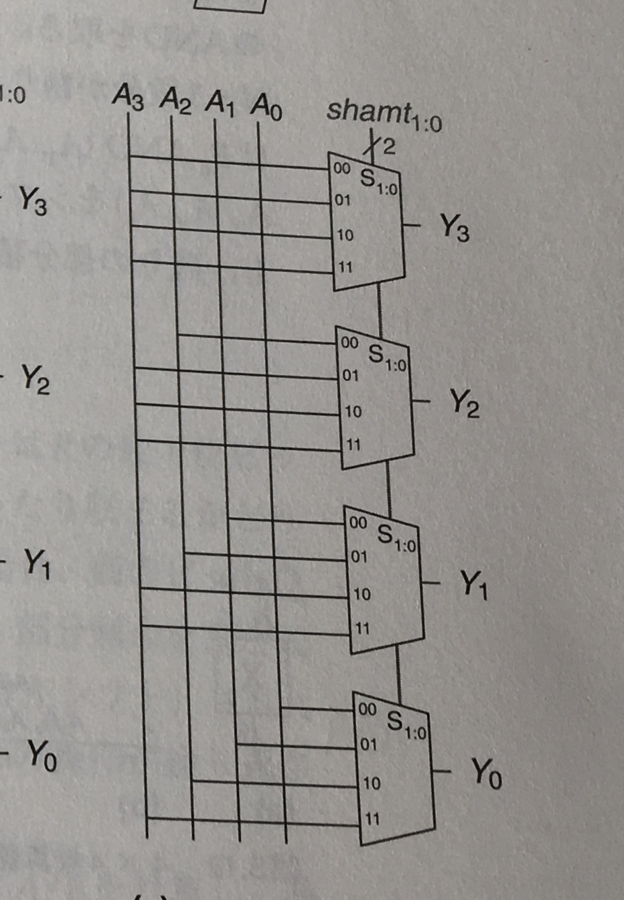
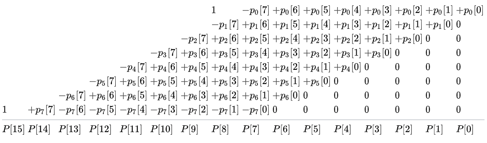

# ALU実装と乗算と除算と
## 前回の補足
### inc回路
ずっと1につないでいる＝消費電力やばい。  
各桁、値が変わるのは自分より下のbitがすべて1である時。  
    ――→ANDとXORでつなげばいいじゃん！  
  
  
### dec回路
incと逆に考える。  

## ALU
**ALU：Arithmetic Logic Unit(算術論理演算器)**  
制御信号に応じて、計算を行うCPUの根幹。  

[HDL実装例](https://github.com/NeM-T/hdl_practice/blob/master/alu/alu1.sv)  
  
## シフト
### 論理シフト
シフトすることで空く桁に必ず0を入れる。nビット左シフトは2^n倍、右シフトは2^(-n)倍を意味する。  
  
  
  
  
### 算術シフト
右シフト時に先頭(符号bit)をシフトすることで空く桁に入れる。負の数に対応できる。  
  
  
  

   
### ローテート
シフトによってはみ出る部分を空いた部分に当てはめる。  
  
  

  
## 乗算
### 符号なし乗算器
筆算と同じようにする。  
  
aとbの乗算の場合bの各桁をaのすべての桁とのANDをとり、bの桁数-1分シフトし、加算する。
  
[HDL実装例](https://github.com/NeM-T/hdl_practice/blob/master/multiplier/multiplier2.sv)  
  
これは簡単な実装例であり、もっと最適化されたものはある。  
[これ](http://kivantium.hateblo.jp/entry/2016/12/08/000000)とか。  
  
### 符号付き乗算器
  
  
## 除算  
### 回復法  

## （ALUを拡張）

## 参考
[シフト演算](http://kccn.konan-u.ac.jp/information/cs/cyber03/cy3_shc.htm)  
[booth 乗算器の話](https://tom01h.exblog.jp/28143770/)  
[**ディジタル回路設計とコンピュータアーキテクチャ**](https://www.shoeisha.co.jp/book/detail/9784798147529)  
[コンピュータシステムの理論と実装](https://www.oreilly.co.jp/books/9784873117126/)
